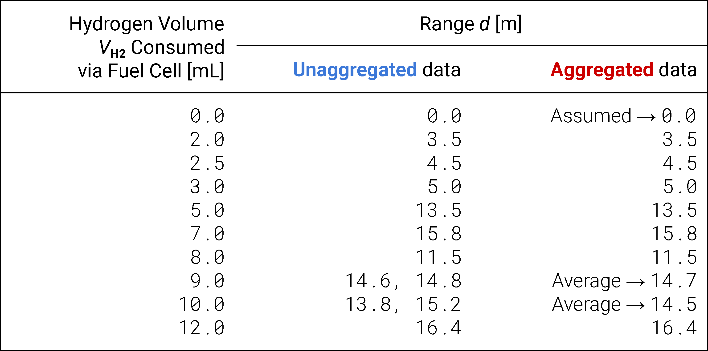
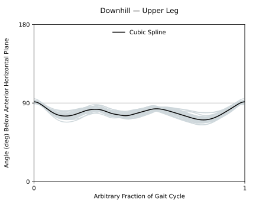
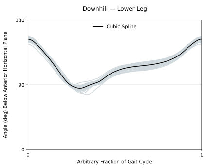
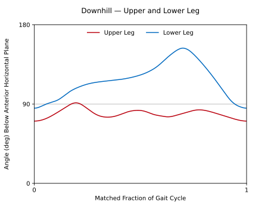
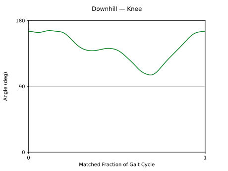
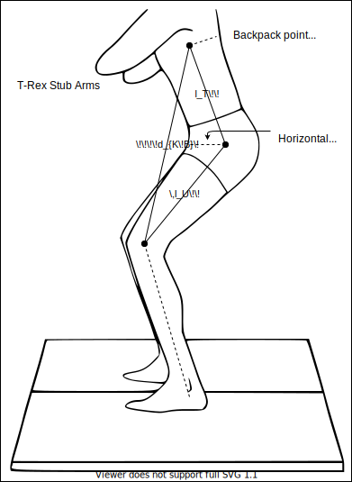
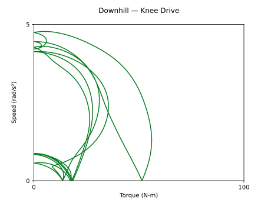
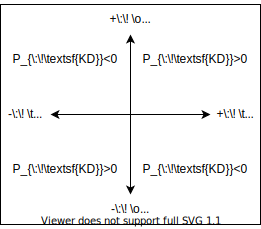

Requisites
==========

* Numerical methods
* Rigid body dynamics
* Biomechanics

----

Function my_smooth()
====================

Applies a moving average algorithm to a *periodic* signal, specifically for knee angular velocity and acceleration over the course of the gait cycle.

----

The first (inclusive) and last (not inclusive) extended indices for what would be a 'circular' array are computed::

    start = - window // 2
    stop  = + window // 2 + np.size(arr_p)

.. admonition:: Note

    Operation ``a // b`` is equivalent to ``floor(a / b)`` --- floor/integer division.

All indices of the to-be-determined extended array ``arr_p`` and given noncircular array ``arr`` are computed::

    idx   = range(start, stop)        # To be out-of-bounds *queries*, for numpy.interp().
    idx_p = range(0, np.size(arr_p))  # To be within-bounds *samples*, for numpy.interp().

Function ``numpy.interp()`` supports periodic or already-repeated sample arrays. (The latter case of which might explain the need to specify a ``period``.) This feature alone is taken advantage of, without actual interpolation::

    arr = np.interp(idx, idx_p, arr_p, period = np.size(arr_p))

The moving average of the extended array is taken using a centered, constant-size ``window`` that no longer 'overflows' past what *were* the first and last indices of the *original* array::

    return pd.Series(arr).rolling(window, center = True).mean().to_numpy()[- start : stop]

----

Function get_xy()
=================

Derives periods :math:`\small T` (seconds) of recorded gait cycles to be used in numerical differentiation, queried gait cycle fractions :math:`x_q` of a cubic spline model, and their corresponding limb segment angle data :math:`y_q` (degrees).

.. table::
    :align: center

    ====================================  =======================================
    Variable Naming Convention            Meaning                                
    ====================================  =======================================
    Lower case                            Of one or more (separated) gait cycles 
    Upper case, except ``X1`` and ``X2``  Of multiple gait cycles (not separated)
    Suffix: ``_data``                     Model-ready points (input)             
    Suffix: ``q``                         Model query points (output)            
    ====================================  =======================================

----

A moving average algorithm is applied **---** mainly for convenience **---** to smooth out undesirable peaks of relatively 'extreme' value but low *prominence*::

    Y_smooth = pd.Series(Y).rolling(window, center = True).mean().to_numpy()

.. math::

    Y_\textsf{smooth}[\,i\,]={\rm mean}\underbrace{\{\,\dots,\,Y[\,i-1\,],\,Y[\,i\,],\,Y[\,i+1\,],\,\dots\,\}}_\textsf{moving window}

where ``...`` happens to just be :math:`\small Y[\,i\pm({\rm window}-1)\,/\,2=2\,]` in our case (:math:`\small{\rm window}=5`).

The first and last two values of ``Y_smooth`` are ``NaN`` (i.e., undefined) due to the centered, constant-size window 'overflowing' beyond these points instead of shrinking to fit those available. Because these values are to be discarded in our case, this is acceptable.

.. admonition:: Note

    Function ``pandas.DataFrame.rolling()`` does not properly support adjustable-width or even-valued windows, let alone non-integer ones.

An even-valued window would also be 'split up' between endpoint *weights*:

.. math::

    Y_\textsf{smooth}[\,i\,]=\frac{0.5\,Y[\,i-2\,]+Y[\,i-1\,]+Y[\,i\,]+Y[\,i+1\,]+0.5\,Y[\,i+2\,]}{4}

----

::

    from scipy.signal import find_peaks

A peak finding algorithm is applied to find candidate points for splitting up individual gait cycles::

    peaks, _ = find_peaks(Y_smooth)  # indices
    heights = - Y_smooth[peaks]      # values (negative for convenience when sorting...)

.. admonition:: Note

    For reference: Function ``scipy.signal.find_peaks()`` also supports a minimum ``height``, a required ``threshold`` relative to adjacent values, a minimum ``distance`` between indices, a minimum ``prominence``, a minimum ``width``, and a minimum ``plateau_size``.

:math:`\small\rm(peaks,heights)` is temporarily converted to a ``pandas`` 'DataFrame' to remove peak locations whose corresponding heights are not sufficiently 'extreme' for partitioning valid gait cycles::

    peaks = pd.DataFrame(np.c_[peaks, heights])

              .sort_values(1)          # Sort everything by −height (ascending).
              .iloc[: cycles + 1, 0]   # Keep only relevant peak locations.
              .sort_values()           # Re-sort the filtered peak locations.

              .to_numpy().astype(int)  # Convert to a numpy array of integers for valid indexing.

.. table::
    :align: center

    =======  ==============================  ==============================
    *DataFrame*                                                            
    -----------------------------------------------------------------------
    *Index*  *Series* 0                      *Series* 1                    
    =======  ==============================  ==============================
    ...      ``peaks`` **---** sorted 2nd    ``heights`` **---** sorted 1st
    =======  ==============================  ==============================

----

The time periods :math:`\small T` (seconds) of each recorded gait cycle are also computed, where sampling frequency :math:`\small f_\textsf{s}=100\ \rm Hz` (samples per second) converts from data point index to real time::

    T = np.diff(peaks) / fs

.. admonition:: Note

    Function ``numpy.diff()`` does not necessarily mean numerical differentiation (e.g., in this case).

----

The following variables are initialized to empty lists such that they may be added to:

* :math:`\small(x,y)` will be a pair of 2-D nested lists of **gait cycle fractions** and corresponding limb segment angle data for *each* cycle, *both* with redundant endpoints.

* :math:`\small(x_{\:\!\textsf{data}},y_{\:\!\textsf{data}})` will be a pair of 1-D flattened lists of gait cycle fractions and corresponding limb segment angle data for *all* cycles, *neither* with redundant endpoints. These will be ready to model.

::

    x, y, x_data, y_data = [], [], [], []

.. admonition:: Note

    The more concise ``x = y = x_data = y_data = []`` is syntactically correct but would create *shallow* 'copies' **---** as opposed to true *deep* copies **---** of one empty list.

Now, for each arbitrarily positioned gait cycle, partitioned by relevant peaks::

    for i in range(0, np.size(peaks) - 1):

        x.append(np.linspace(0, 1, peaks[i + 1] - peaks[i] + 1))  # Include the current gait cycle fraction.
        y.append(Y_smooth[peaks[i] : peaks[i + 1] + 1])           # Include its corresponding limb segment angle data.

        plt.plot(x[i], y[i], color = ...)                         # Add to a matplotlib plot.

        x_data = np.r_[x_data, x[i][1 :]]                         # Include the current gait cycle fraction.
        y_data = np.r_[y_data, y[i][1 :]]                         # Include its corresponding limb segment angle data.

.. admonition:: Notes

    * Function ``numpy.diff()`` can only simplify some of this.
    * Method ``.append()`` is necessary for ``x`` and ``y``, but not their ``_data`` equivalents.
    * Not-technically-a-function ``numpy.r_[]`` essentially concatenates ``numpy.array()`` rows. Similarly, ``numpy.c_[]`` will concatenate columns.

The startpoints of :math:`\small(x_{\:\!\textsf{data}},y_{\:\!\textsf{data}})` **---** initially removed for convenience **---** are re-included::

    x_data = np.r_[x[0][0], x_data]
    y_data = np.r_[y[0][0], y_data]

----

Repeat :math:`\small(x_{\:\!\textsf{data}},y_{\:\!\textsf{data}})` for ``reps`` × 1 gait cycle::

    X1, X2 = np.meshgrid(x1 = x_data[1 :], x2 = range(0, reps))  # X1, X2, x1, and x2 are not gait cycle fractions.

    X_data = np.r_[x_data[0], np.ndarray.flatten(X1 + X2)]
    Y_data = np.r_[y_data[0], np.tile(y_data[1 :], reps)]

This is explained with the aid of a simplified example:

===  ===  ===  ===  ===  ===  ===  ===
:math:`x_1`         :math:`x_2`       
==================  ==================
0.1  0.2  0.3  ...  0    1    2    ...
===  ===  ===  ===  ===  ===  ===  ===

===  ===  ===  ===  ===  ===  ===  ===  ===  ===  ===  ===  ===
:math:`X_1`         :math:`X_2`              :math:`X_1+X_2`   
------------------  ------------------  ---  ------------------
Repeated by Row     Repeated by Column  Rep                    
==================  ==================  ===  ==================
0.1  0.2  0.3  ...  0    0    0    ...  1    0.1  0.2  0.3  ...
0.1  0.2  0.3  ...  1    1    1    ...  2    1.1  1.2  1.3  ...
0.1  0.2  0.3  ...  2    2    2    ...  3    2.1  2.2  2.3  ...
...  ...  ...       ...  ...  ...       etc  ...  ...  ...     
===  ===  ===  ===  ===  ===  ===  ===  ===  ===  ===  ===  ===

===  ===  ===  ===  ===  ===  ===  ===  ===  ===  ===  ===  ===
:math:`{\rm flatten}(X_1+X_2)`                                 
---------------------------------------------------------------
1st Rep             2nd Rep             3rd Rep             etc
==================  ==================  ==================  ===
0.1  0.2  0.3  ...  1.1  1.2  1.3  ...  2.1  2.2  2.3  ...  ...
===  ===  ===  ===  ===  ===  ===  ===  ===  ===  ===  ===  ===

.. admonition:: Note

    Function ``numpy.meshgrid()`` is actually intended to generate an array of sampling points for :math:`\small N`-dimensional plotting.

----

Option 1 --- Function get_natural_cubic_spline_model()
------------------------------------------------------

::

    from get_natural_cubic_spline_model import get_natural_cubic_spline_model

The number of knots **---** that is, endpoints in a cubic `smoothing spline <https://en.wikipedia.org/wiki/Smoothing_spline>`_ **---** is computed::

    n_knots = 1 + knots_per_rep * reps

A `natural cubic spline <https://en.wikipedia.org/wiki/Spline_(mathematics)#Algorithm_for_computing_natural_cubic_splines>`_ model is generated and 'packaged' in *lambda function* :math:`\small{\rm spl}(x)`::

    model = get_natural_cubic_spline_model(X_data, Y_data, min(X_data), max(X_data), n_knots)

    spl = lambda x: model.predict(x)

.. admonition:: Note

    `Function <https://stackoverflow.com/a/51359826>`_ ``get_natural_cubic_spline_model()`` contains classes ``AbstractSpline()`` and ``NaturalCubicSpline()`` from a *basis expansion* `module <https://github.com/madrury/basis-expansions/blob/master/basis_expansions/basis_expansions.py>`_ by `Matthew Drury <https://github.com/madrury>`_.

Option 2 --- Class scipy.interpolate.UnivariateSpline()
-------------------------------------------------------

::

    from scipy.interpolate import UnivariateSpline

.. admonition:: Note

    `Class <https://docs.scipy.org/doc/scipy/reference/generated/scipy.interpolate.UnivariateSpline.html>`_ ``scipy.interpolate.UnivariateSpline()`` does not support unsorted or duplicate sample points, but it *does* support sample *weights*.

To begin using this feature, :math:`\small Y_{\:\!\textsf{data}}` are *pivoted* with respect to :math:`\small X_{\:\!\textsf{data}}`, as exemplified by the following data table (observations from a fuel cell toy car experiment).

Similarly, a *pivot table* DataFrame (`reference <https://pandas.pydata.org/pandas-docs/stable/reference/api/pandas.DataFrame.pivot_table.html>`_) is generated::

    df = pd.DataFrame(np.c_[X_data, Y_data]).pivot_table(values = 1, index = 0, aggfunc = ['mean', 'count'])

.. table::
    :align: center

    ==============  ==============  ==============
    *DataFrame.pivot_table*                       
    ----------------------------------------------
    *Index*         *Series* 0      *Series* 1    
    ==============  ==============  ==============
    New ``X_data``  New ``Y_data``  Weights: ``w``
    ==============  ==============  ==============

The new :math:`\small X_\textsf{data}`, new :math:`\small Y_\textsf{data}`, and :math:`w` are extracted from this new DataFrame::

    X_data = df.index.to_numpy()  # (new X_data) = unique (old X_data).

    Y_data = df.to_numpy()[:, 0]  # For each new X_data, (new Y_data) = mean (old Y_data).
    w      = df.to_numpy()[:, 1]  # For each new X_data, weights w = … count (old Y_data).

A model is generated (already in the form of a lambda function), where :math:`s` is the smoothing parameter::

    spl = UnivariateSpline(X_data, Y_data, w, s = 5e4)

----

If ``reps % 2 != 0`` (i.e., the number of repeated identical gait cycles is not even-valued)::

    xq = np.linspace(0, 1, nq + 1)[: -1]                         # Discard endpoint. 'Break' at x = 0.
    yq = spl(xq + (reps - 1) / 2)                                # Middle cycle.

where ``nq`` is the number of query points. Otherwise::

    xq1 = np.linspace(0.0, 0.5, round(nq / 2) + 1)               # Keep endpoint.
    xq2 = np.linspace(0.5, 1.0, round(nq / 2) + 1)               # Keep endpoint. 'Break' at x = 0.5 only.

    yq1 = spl(xq1 + reps / 2 - 0)                                # Second half of the middle-left cycle.
    yq2 = spl(xq2 + reps / 2 - 1)                                # First half of the middle-right cycle.

    xq  = np.r_[xq1[: -1], (xq1[-1] + xq2[0]) / 2, xq2[1 : -1]]  # One full gait cycle.
    yq  = np.r_[yq1[: -1], (yq1[-1] + yq2[0]) / 2, yq2[1 : -1]]  # One full gait cycle.

``xq1[0] == xq2[-1] == 0`` so the latter is discarded for simplicity, but ``xq1[-1] != xq2[0]`` so the average of the two is taken for :math:`x_q`. The same applies to :math:`y_q`.

----

Plot :math:`\small(x_q,y_q)` with endpoints::

    line = plt.plot(np.r_[xq, 1], np.r_[yq, yq[0]], color = ...);  ...

Anterior = in front of the human subject.

----

::

    return T, xq, yq

----

.. TODO: explain section 0.1.7

.. TODO: derive speed-torque curve envelope

.. TODO: add section 0.2

.. TODO: append contents to "Deriving_the_Speed_Torque_Curve_for_a_Knee_Exoskeleton.rst"
         or
         rename to "0.1. Downhill (_D).rst" and split "Deriving...Exoskeleton.rst" into (a) "Function my_smooth().rst"
                                                                                        (b) "Function get_xy().rst"

1. Downhill (_D)
================

To-do.

::

    Y_U_D
    |
    Y <――――――― limb angle data
     _U <――――― upper leg
       _D <――― decline (downhill)

===========================  ========================  ===========================  ========================
Variable Naming Convention   Meaning                   Variable Naming Convention   Meaning                 
===========================  ========================  ===========================  ========================
Suffix: ``_U``               Upper leg                 Suffix: ``_D``               Decline  (downhill)     
Suffix: ``_L``               Lower leg                 Suffix: ``_I``               Incline  (uphill)       
Suffix: ``_K``               Knee                                                                           
Suffix: ``_T``               Trunk/Torso                                                                    
Suffix: ``_B``               Back(pack)                                                                     
===========================  ========================  ===========================  ========================

===========================  ========================
Variable Naming Convention   Meaning                 
===========================  ========================
``theta`` → ``θ`` in Python  Angle                   
``omega`` → ``ω``            Angular velocity        
``alpha`` → ``α``            Angular acceleration    
===========================  ========================

----

1.1. Upper Leg (_U) Angle
-------------------------

Upper leg angle data :math:`{\small Y}_\textsf{UD}` (degrees), known to be representative of :math:`n\small=37` gait cycles, is loaded from the GitHub repository::

    Y_U_D = pd.read_csv('https://raw.github.com/keeganmjgreen/MSE-420-Project/master/data/Y_U_D.csv').to_numpy()

The corresponding gait cycle periods :math:`{\small T}_{\:\!\textsf{UD}}`, gait cycle fractions (model input points) :math:`x_{q,\:\!\textsf{UD}}`, and angle data (model output points) :math:`y_{\:\!q,\:\!\textsf{UD}}` are derived::

    T_U_D, xq, yq_U_D = get_xy(Y_U_D, fs, window, 37, reps, knots_per_rep, nq);  ...

(At the same time, the model fit is superimposed over its plotted source data...)

----

1.2. Lower Leg (_L) Angle
-------------------------

Similarly, for the lower leg, with :math:`n\small=38` gait cycles::

    Y_L_D = pd.read_csv('https://raw.github.com/keeganmjgreen/MSE-420-Project/master/data/Y_L_D.csv').to_numpy()

    T_L_D, xq, yq_L_D = get_xy(Y_L_D, fs, window, 38, reps, knots_per_rep, nq);  ...

----

1.3. Upper and Lower Leg Angles
-------------------------------

Arbitrary gait cycle fractions are aligned/matched knowing that the leg is approximately straightened when the upper and lower leg reach minimum `extension` and `flexion`, respectively, at the same time :math:`t^\ast`:

.. math::

    \theta_{\:\!\textsf{U}}(t^\ast)=\min_{\stackrel{}{t}}\:\!(\theta_{\:\!\textsf{U}})\approx\min_{\stackrel{}{t}}\:\!(\theta_{\:\!\textsf{L}})=\theta_{\:\!\textsf{L}}(t^\ast)

::

    θq_U_D = np.roll(yq_U_D, - np.argmin(yq_U_D))         # Perform a 'circular shift': upper leg angle data.
    θq_L_D = np.roll(yq_L_D, - np.argmin(yq_L_D));  ...   # Perform a 'circular shift': lower leg angle data.

    plt.plot(np.r_[xq, 1], np.r_[θq_U_D, θq_U_D[0]], ...)        # Plot with endpoints: upper leg angle data.
    plt.plot(np.r_[xq, 1], np.r_[θq_L_D, θq_L_D[0]], ...);  ...  # Plot with endpoints: lower leg angle data.

----

1.4. Knee (_K) Angle
--------------------

::

    θq_K_D = θq_U_D - θq_L_D + 180;  ...

    plt.plot(np.r_[xq, 1], np.r_[θq_K_D, θq_K_D[0]], color = ...);  ...  # Plot with endpoints: knee angle data.

----

::

    θq_K_D = np.deg2rad(θq_K_D)  # Switch from degrees to radians for angular velocity and acceleration.

The mean `model` sampling period is computed from that of all recorded gait cycle fractions and the number of query points ``nq`` per cycle::

    Ts_D = np.mean(np.r_[T_L_D, T_U_D]) / nq

The same gait cycle period is expected between the upper and lower leg, but not between uphill and downhill. This will be a step size for numerical differentiation. The gait cycle period for walking uphill (1.15 s) was consistently longer than walking downhill (1.15 s), as expected.

A 2× resolution array of gait cycle fractions is computed for supersampling [#f1]_ between even-numbered (knee angle, angular acceleration) and odd-numbered (angular velocity) centered finite difference derivatives::

    x = np.linspace(0, 1, 2 * nq + 1)[: -1]

.. rubric::

.. [#f1] This is not a correct term.

----

1.5. Knee Angular Velocity
--------------------------

The knee angular velocity is computed using numerical differentiation, and smoothed **---** to reduce the noise that it introduces **---** where ``nq / fs`` converts from a moving average window sized for sampling to one suited for querying the `model`::

    ωq_K_D = np.diff(np.r_[θq_K_D, θq_K_D[0]]) / Ts_D
    ωq_K_D = my_smooth(ωq_K_D, window * round(nq / fs))

:math:`\omega_{q,\:\!\textsf{KD}}` is 'doubly-interpolated', primarily for plotting near the beginning and end of the gait cycle::

    ω_K_D = np.interp(x, xq + 1 / (2 * nq), ωq_K_D, period = 1);  ...

    plt.plot(np.r_[x, 1], np.r_[ω_K_D, ω_K_D[0]], ...);  ...  # Plot ω_K_D with endpoints.

.. image:: ω_K_D.svg
    :align: center
    :scale: 8%

When :math:`\omega_{\:\!\textsf{KD}}` is positive (:math:`{\small\theta}_{\:\!\textsf{KD}}` is increasing), the upper leg is *rotating* **---** and the torso is *moving* **---** upward. The opposite is true when :math:`\omega_{\:\!\textsf{KD}}<0`.

----

1.6. Knee Angular Acceleration
------------------------------

Similarly, for angular acceleration::

    αq_K_D = np.diff(np.r_[ωq_K_D, ωq_K_D[0]]) / Ts_D
    αq_K_D = my_smooth(αq_K_D, window * round(nq / fs))

    α_K_D = np.interp(x, xq + 1 / (2 * nq), αq_K_D, period = 1);  ...

    plt.plot(np.r_[x, 1], np.r_[α_K_D, α_K_D[0]], ...);  ...

.. image:: α_K_D.svg
    :align: center
    :scale: 8%

When :math:`\alpha_{\:\!\textsf{KD}}` is positive (:math:`\omega_{\:\!\textsf{KD}}` is increasing), the upper leg and torso are accelerating upward. The opposite is true when :math:`\alpha_{\:\!\textsf{KD}}<0`.

----

1.7. Knee Drive Speed--Torque Relationship
------------------------------------------

In this figure, the length of the topmost dashed line is assumed to be negligible. Furthermore, without knowing the shape, size, or mass distribution of a backpack and its contents, the load is approximated to be a `point mass <https://en.wikipedia.org/wiki/Point_particle#Physical_point_mass>`_ with no rotational inertia about its center.

===========================  ========================
Variable Naming Convention   Meaning                 
===========================  ========================
``l``                        Length of a limb segment
``d``                        Distance between points 
===========================  ========================

===========================  ========================
Variable Naming Convention   Meaning                 
===========================  ========================
Greek letter ``ι``           Rotational inertia      
Greek letter ``τ``           Torque                  
===========================  ========================

::

    H   = 1.8  # Typical height of a person (meters).
    m_B = 1.0  # Unity backpack load (kilograms).
    g   = 9.8  # Gravitational acceleration.

    l_T = (0.720 - 0.530) * H  # Length of the trunk between the hip joint and backpack point of attachment.
    l_U = (0.530 - 0.285) * H  # Length of the upper leg.

The `rotational inertia <https://en.wikipedia.org/wiki/Moment_of_inertia>`_ of backpack load :math:`m_B` about the knee joint axis is computed using the `parallel axis theorem <https://en.wikipedia.org/wiki/Parallel_axis_theorem>`_ and law of cosines, where :math:`d_{K \! B}` is the distance between the knee and backpack point of attachment:

.. math::

    \iota_D = m_B \, d_{K \! B} ^ {\, 2} = m_B \, (l_T ^ {\, 2} + l_U ^ {\, 2} - 2 \, l_T \, l_U \cos (\theta_{U \! D} + 90 ^ \circ))

::

    ι_D = m_B * (l_T ** 2 + l_U ** 2 - 2 * l_T * l_U * np.cos(np.deg2rad(θq_U_D + 90)))

.. admonition:: Comment

    Moment of inertia = mass moment of inertia = angular mass = rotational inertia. I use only the term *rotational inertia* because the quantity is neither a moment (torque), nor a mass **---** it can mean that a torque is *applied* (under angular acceleration), and it is merely the rotational *analog* of mass.

The drive torque about the knee joint axis is computed for the required acceleration:

.. math::

    \tau_{K\!D} = \iota_D \, \alpha_{K \! D} + m_B \, l_U \cos(\theta_{U \! D}) \, g

::

    τq_K_D = ι_D * αq_K_D + m_B * l_U * np.cos(np.deg2rad(θq_U_D)) * g

A plot of :math:`\small |\tau_{K \! D}|` against :math:`\small |\omega_{K \! D}|` **---** namely, the *speed--torque curve* required for the knee drive **---** is generated::

    plt.plot(abs(τq_K_D), abs(ωq_K_D), ...)

Each point :math:`\small (|\tau_{K \! D}|, |\omega_{K \! D}|)` along the speed--torque curve is written to a CSV file, initially for use with MATLAB's interactive plotting features::

    writer = csv.writer(open('_D.csv', 'w', newline = ''))

    writer.writerows([['abs(τq_K_D)', 'abs(ωq_K_D)']])          # headers
    writer.writerows(np.c_[abs(τq_K_D), abs(ωq_K_D)].tolist())  # columns

Now using MATLAB, the speed--torque curve 'envelope' is generated:

.. close

.. figure('Color', 'none')

.. hold on
.. grid on
.. box  on

.. x_min =  4.7216;
.. x_max = 56.0832;
.. y_min =  1.3239;
.. y_max =  4.7736;

.. plot([     0, x_min ], [ y_max, y_max ], 'Color', '#087F23', 'LineWidth', 1)
.. plot([ x_max, x_max ], [ y_min,     0 ], 'color', '#087F23', 'LineWidth', 1)

.. f = @(x, y) ((x - x_min) ./ (x_max - x_min)) .^ 2 + ((y - y_min) ./ (y_max - y_min)) .^ 2 - 1;

.. fimplicit(f, [x_min, x_max, y_min, y_max], 'color', '#087F23', 'LineWidth', 1)

.. xlabel({'', 'Torque (N-m)', ''})
.. ylabel({'', 'Speed (rad/s²)'})

.. title({'', 'Downhill — Knee Drive', ''})

.. xlim([ 0, 100 ])
.. ylim([ 0,   5 ])

.. xticks([ 0, x_max ])
.. yticks([ 0, y_max ])

.. print('ω_vs_τ_K_D''', '-dsvg')

.. table::
    :align: center

    +--------------------------------+
    | Knee Drive Speed--Torque Curve |
    +================================+
    | .. image:: ω_vs_τ_K_D'.svg     |
    |     :align: center             |
    |     :scale: 52%                |
    +--------------------------------+

**4.7736 rad/s²** and **56.0832 N-m** are the minimum required *no-load speed* and *stall torque* of the knee drive, respectively.

----

Appendix
========

