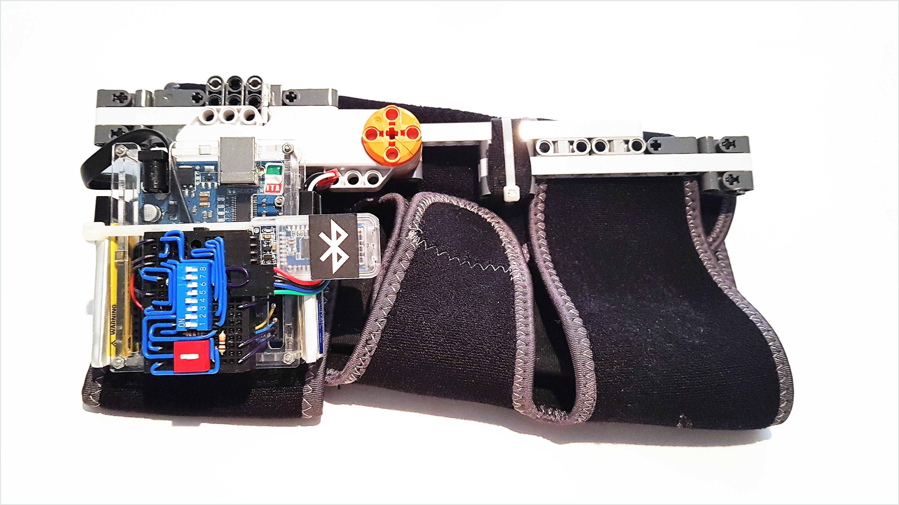
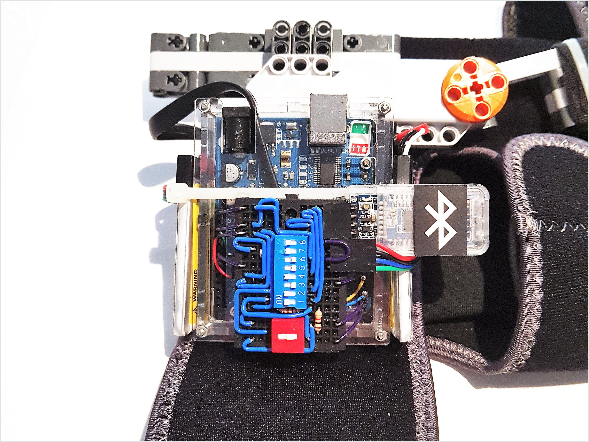
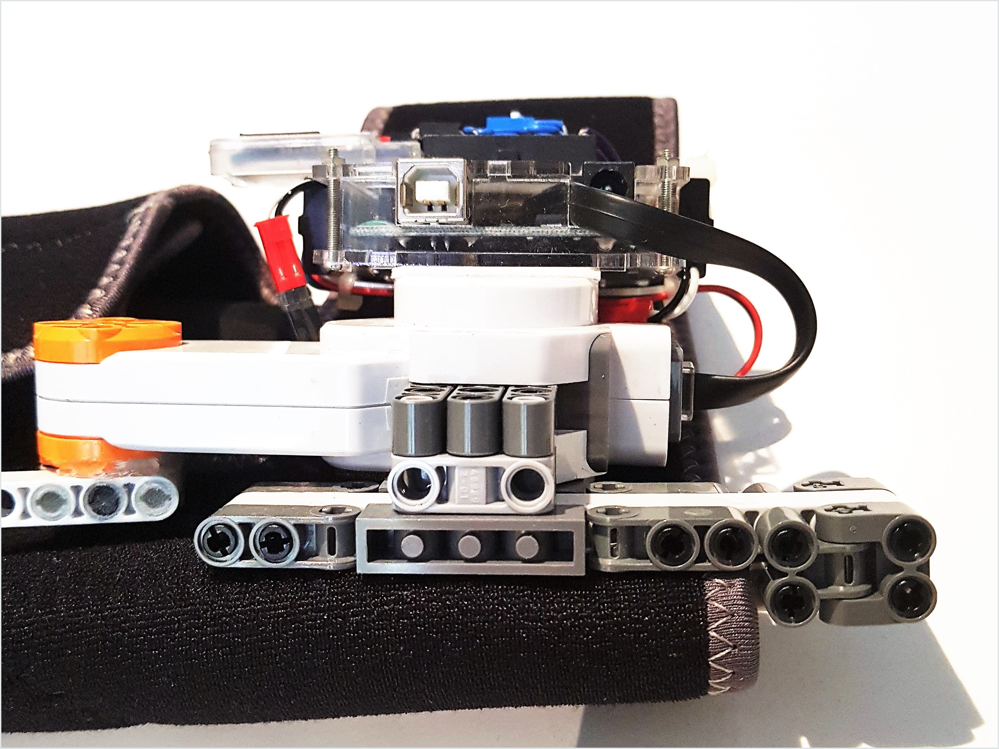

Knee Angle Data Logger
======================

In my team's `report <https://raw.github.com/keeganmjgreen/MSE-420-Project/master/Project%20%E2%80%94%20Design%20of%20an%20Active%20Knee%20Exoskeleton.pdf>`_, I mentioned that we considered using a *quadrature encoder built into a servo motor* for recording both speed and direction of the knee, but I decided against it because of its gearbox's mechanical resistance to what would otherwise be 'natural movement'. Months after the main project, I decided to design and construct a piece of wearable tech **---** an optionally-wireless *knee angle data logger* **---** to verify or disprove this assumption, for starters.

----

It turns out that this likely has less of an effect than initially thought. In contrast, however, the lack of `mechanical compliance <https://en.wikipedia.org/wiki/Compliant_mechanism>`_ even with at least some material flexibility, and the heavy rotational inertia of the device about the leg as it sways, are issues. In future work, the latter may be largely solved by making the sizable prototype of its data acquisition electronics more compact and/or offloading it elsewhere along and closer to the leg.

----

The device consists of the following.

* An ergonomic fabric cuff/brace that velcro-straps around the leg **---** above, below, and at the knee.
* A servo motor (with a built-in quadrature encoder) **---** its housing and axle spanning the brace.
* A microcontroller 'unit' (MCU) **---** in part to convert the encoder signals to an updated value of the knee angle.
* A wireless transceiver **---** to transmit knee angle data to a phone.
* Two rechargeable LiPo batteries **---** to power the MCU and the transceiver via the MCU.
* A mini protoboard **---** to connect the previous three electrical parts/components.

----

System Level Block Diagrams and Technical Details
---------------------------

----

Programming the Arduino
^^^^^^^^^^^^^^^^^^^^^^^

|image1|

| •  The computer transmits information (a program from the Arduino IDE, in the above case) to the Arduino (and vice-versa, albeit little in the above case) via USB.
| •  “USB-to-UART” is actually part of an IC onboard the Arduino.
| •  USB 2 here uses half-`duplex <https://en.wikipedia.org/wiki/Duplex_(telecommunications)>`__ (two-way) `serial communication <https://en.wikipedia.org/wiki/Serial_communication>`__ and `differential signaling <https://en.wikipedia.org/wiki/Differential_signaling>`__.
| •  UART uses full-`duplex <https://en.wikipedia.org/wiki/Duplex_(telecommunications)>`__ (simultaneous two-way) `serial communication <https://en.wikipedia.org/wiki/Serial_communication>`__.
| •  UART = `Universal Asynchronous Receiver-Transmitter <https://en.wikipedia.org/wiki/Universal_asynchronous_receiver-transmitter>`__ communication protocol.

----

Programming the BLE Module
^^^^^^^^^^^^^^^^^^^^^^^^^^

|image2|

| •  The computer transmits information (BLE module configuration ``AT`` commands from any serial monitor, in the above case) to the BLE module (and vice-versa) through the Arduino via USB.
| •  Again, “USB-to-UART” and “UART-to-USB” are actually parts of an IC onboard the Arduino. This IC is ‘tied’ to the Arduino ``TX`` and ``RX`` pins.
| •  ``TX`` transmits via UART from the labeled device.
| •  ``RX`` receives via UART from a communicating device.
| •  \*using a `voltage divider <https://en.wikipedia.org/wiki/Voltage_divider>`__ with a 1-kΩ resistor from 5.0 V to 3.3 V and a 2-kΩ resistor from 3.3 V to ground (Arduino ``GND`` pins).
|    The `logical high voltage levels <https://en.wikipedia.org/wiki/Logic_level>`__ of the Arduino microcontroller and Bluetooth 4.0 BLE module are around 5.0 V (Arduino ``5V0`` pin) and 3.3 V (Arduino ``3V3`` pin), respectively.
|    As such and in this one case, not using a `level shifter <https://en.wikipedia.org/wiki/Level_shifter>`__ such as an equivalent voltage divider or transistor equivalent may damage the BLE module.
| •  BLE = `Bluetooth Low Energy <https://en.wikipedia.org/wiki/Bluetooth_Low_Energy>`__.

----

Logging Knee Angle Data (Default Operation Mode)
^^^^^^^^^^^^^^^^^^^^^^^

|image3|

| •  Technically-not-a-`servomotor <https://en.wikipedia.org/wiki/Servomotor>`__ (No built-in `feedback <https://en.wikipedia.org/wiki/Feedback>`__ `control <https://en.wikipedia.org/wiki/Control_theory>`__ of position or speed.)
|    •  `Actuator <https://en.wikipedia.org/wiki/Actuator>`__: `DC motor <https://en.wikipedia.org/wiki/DC_motor>`__ with `gear train <https://en.wikipedia.org/wiki/Gear_train>`__.
|    •  `Sensor <https://en.wikipedia.org/wiki/Sensor>`__: Optical **Rotary Encoder** (`reference <https://en.wikipedia.org/wiki/Rotary_encoder>`__) in *quadrature*.
|       •  For position feedback or just sensing (in this case).
|       •  *Encodes* direction as well as knee angle `increments/decrements <https://en.wikipedia.org/wiki/Incremental_encoder>`__ (0.5° resolution).
|       •  Transparent disc with two opaque, circular ‘barcodes’ offset from each other by 0.5°.
|       •  `LED <https://en.wikipedia.org/wiki/Light-emitting_diode>`__–`photodiode <https://en.wikipedia.org/wiki/Photodiode>`__ pairs placed across these patterned ‘light-slots’.
|       •  Outputs two digital signals.
| •  `Arduino <https://www.arduino.cc/>`__ **Microcontroller**.
|    •  Receives encoder signals on digital pins “A” and “B”.
|    •  *Decodes* knee angle from encoder output.
| • **UART-to-BLE** = `DSD TECH HM-10 Master and Slave Bluetooth 4.0 LE Module <https://www.amazon.ca/DSD-TECH-Bluetooth-iBeacon-Arduino/dp/B06WGZB2N4>`__.
|    •  Connected to the Arduino ``TX`` and ``RX`` pins.
| •  Android **Phone**.
|    •  `Serial Bluetooth Terminal <https://play.google.com/store/apps/details?id=de.kai_morich.serial_bluetooth_terminal>`__, by `Kai Morich <https://github.com/kai-morich>`__.
| •  Windows 10 **Computer**.
|    •  :doc:`Knee Angle Data Logger Interface <kneeAngleDataLoggerInterface_ipynb>`, by me.

.. |image1| image:: https://mermaid.ink/svg/eyJjb2RlIjoiZ3JhcGggTFJcbiAgICAxW0NvbXB1dGVyXVxuICAgIDJbQXJkdWlubyBNaWNyb2NvbnRyb2xsZXJyXVxuICAgIDEgLS0-fFVTQi10by1VQVJUfCAyIiwibWVybWFpZCI6e30sInVwZGF0ZUVkaXRvciI6ZmFsc2V9
.. |image2| image:: https://mermaid.ink/svg/eyJjb2RlIjoiZ3JhcGggTFJcbiAgICAxW0NvbXB1dGVyXVxuICAgIDJbQXJkdWlubyBNaWNyb2NvbnRyb2xsZXJyXVxuICAgIDEgLS0-fFVTQi10by1VQVJUfCAyXG4gICAgMiAtLT58VUFSVC10by1VU0J8IDFcbiAgICAzW0JMRSBNb2R1bGVdXG4gICAgMiAtLT58VFgtdG8tVFgqfCAzXG4gICAgMyAtLT58UlgtdG8tUlh8IDIiLCJtZXJtYWlkIjp7fSwidXBkYXRlRWRpdG9yIjpmYWxzZX0
.. |image3| image:: https://mermaid.ink/svg/eyJjb2RlIjoiZ3JhcGggTFJcbiAgICAxW1JvdGFyeSBFbmNvZGVyXVxuICAgIDJbQXJkdWlubyBNaWNyb2NvbnRyb2xsZXJyXVxuICAgIDEgLS0-IDJcbiAgICAzW1dpcmVsZXNzIFRyYW5zbWlzc2lvbl1cbiAgICAyIC0tPnxVQVJULXRvLUJMRXwgM1xuICAgIDRbUGhvbmVdXG4gICAgMyAtLT4gNFxuICAgIDVbV2lyZWQgVHJhbnNtaXNzaW9uXVxuICAgIDIgLS0-fFVBUlQtdG8tVVNCfCA1XG4gICAgNltDb21wdXRlcl1cbiAgICA1IC0tPiA2IiwibWVybWFpZCI6e30sInVwZGF0ZUVkaXRvciI6ZmFsc2V9

----

Appendix
--------

====================  =================================================================  ==================================================================
Switch Position [#]_  Functionality                                                      Functionality                                                     
====================  =================================================================  ==================================================================
Switch 6 · ``ON``     Shorts MCU ``RESET`` to MCU ``GND``                                Resets the MCU (temporarily)                                      
Switch 5 · ``ON``     Shorts 7.4 V to MCU ``Vin``                                        Powers on the device                                              
Switch 4 · ``ON``     Shorts BLE module ``GND`` to MCU ``GND``                           Powers on the BLE module thereafter                               
Switch 3 · ``OFF``    Breaks MCU ``GND`` to digital pin 5                                Enables knee angle data transmission (default operation mode)     
Switch 2 · ``ON``     Shorts the MCU ``TX`` to BLE module ``RX`` by default              Enables wirelessly transmitting data --- *logging knee angle data*
Switch 1 · ``ON``     Shorts the MCU ``RX`` to BLE module ``TX`` by default              Enables wirelessly receiving data                                 
Switch 0 · ``C2``     Sets the MCU ``TX``/``RX`` to connect to BLE module ``RX``/``TX``  Enables *logging knee angle data* (default operation mode)        
Switch 0 · ``C1``     Sets the MCU ``TX``/``RX`` to connect to BLE module ``TX``/``RX``  Enables *programming the BLE module*                              
====================  =================================================================  ==================================================================

.. [#] Switch 0 is DPDT (double-pole, double-throw). Switches 1--6 are SPST (single-pole, single-throw).

----
