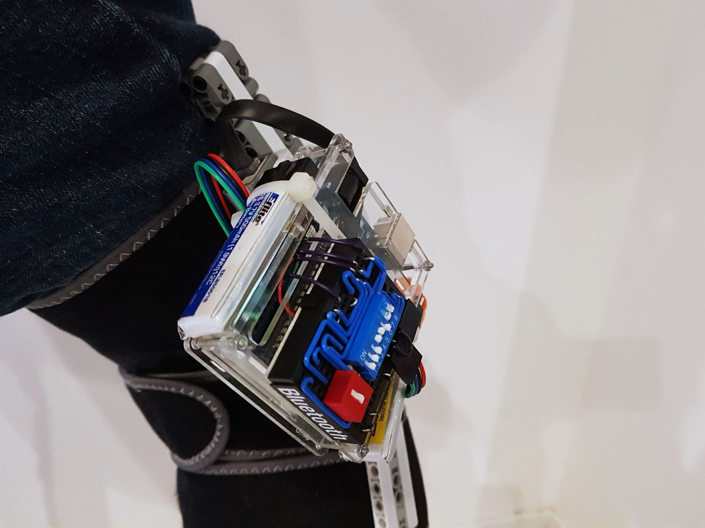
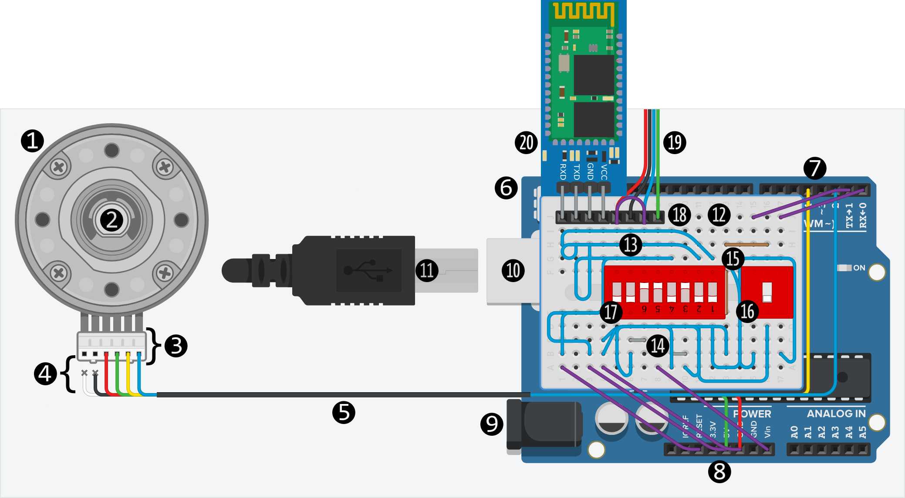

Knee Angle Data Logger
======================

I mentioned in my team's `report <https://raw.github.com/keeganmjgreen/MSE-420-Project/master/Project%20%E2%80%94%20Design%20of%20an%20Active%20Knee%20Exoskeleton.pdf>`_ that we considered using a *quadrature encoder built into a servo motor* for recording both speed and direction of the knee, but I decided against it because of its gearbox's mechanical resistance to what would otherwise be 'natural movement'. Months after the main project, I decided to design and construct a piece of wearable tech **---** an optionally-wireless *knee angle data logger* **---** to verify or disprove this assumption, for starters.

.. image:: kneeAngleDataLogger/fig1.jpg
.. image:: kneeAngleDataLogger/fig2.jpg
.. image:: kneeAngleDataLogger/fig3.jpg

Wearing the knee angle data logger:

Wearing and testing the knee angle data logger by walking around and quickly flexing the knee at different angles:

.. raw:: html

   <embed>
       <iframe width="420" height="315" src="https://www.youtube.com/embed/P3_gfZtLExc" title="YouTube video player" frameborder="0" allow="accelerometer; autoplay; clipboard-write; encrypted-media; gyroscope; picture-in-picture" allowfullscreen></iframe>
   </embed>

----

It turns out that this likely has less of an effect than initially thought. In contrast, however, the lack of `mechanical compliance <https://en.wikipedia.org/wiki/Compliant_mechanism>`_ even with at least some material flexibility, and the heavy rotational inertia of the device about the leg as it sways, are issues. In future work, the latter may be largely solved by making the sizable prototype of its data acquisition electronics more compact and/or offloading it elsewhere along and closer to the leg.

----

The device consists of the following.

- An ergonomic fabric cuff/brace that velcro-straps around the leg **---** above, below, and at the knee.
- An almost-servo motor (with a built-in quadrature encoder) **---** its housing and axle spanning the brace.
- A microcontroller 'unit' (MCU) **---** in part to convert the encoder signals to an updated value of the knee angle.
- A wireless transceiver **---** to transmit knee angle data to a phone.
- Two rechargeable LiPo batteries **---** to power the MCU and the transceiver via the MCU.
- A mini protoboard **---** to connect the previous three electrical parts/components.

❶ Generic representation of the servo motor (with a built-in but externally accessible quadrature encoder) **---** its housing and axle (❷) spanning the knee brace.

❸ The servo motor's 'six-position' (6P) proprietary connection **---** or rather, a generic six-pin--header representation thereof.

❹ The pinout of ❸ and ❺ is as follows.

+-----------------------------+----------------+-----------------------------+---------------------------------------+-----------------------------+-------------------+
| .. image:: img/wire_wht.svg | Motor Negative | .. image:: img/wire_red.svg | to MCU ``GND`` **---** Encoder Ground | .. image:: img/wire_ylw.svg | Encoder Channel A |
|     :align: center          |                |     :align: center          |                                       |     :align: center          |                   |
+-----------------------------+----------------+-----------------------------+---------------------------------------+-----------------------------+-------------------+
| .. image:: img/wire_blk.svg | Motor Positive | .. image:: img/wire_grn.svg | to MCU ``5V0`` **---** Encoder Power* | .. image:: img/wire_blu.svg | Encoder Channel B |
|     :align: center          |                |     :align: center          |                                       |     :align: center          |                   |
+-----------------------------+----------------+-----------------------------+---------------------------------------+-----------------------------+-------------------+

❺ The servo motor's 'six-conductor' (6C) proprietary cable **---** a narrow ribbon cable.

❻ An Arduino MCU.

❼ MCU header pins **---** Digital I/O: (14 total)

- ``RX<0`` receives via UART from a computer connected via USB *OR* from the Bluetooth module to the MCU, one communicating device at a time.
- ``TX>1`` transmits via UART from the MCU to a computer connected via USB *AND* to the Bluetooth module, at the same time.
- ``2`` receives the Encoder Channel B signal.
- ``4`` receives the Encoder Channel A signal.
- ``5`` is the *enable* input for transmitting knee angle data versus pausing the 'transmission loop'.

.. Power
.. -----
.. 
.. "The Arduino Duemilanove can be powered via the USB connection or with an external power supply. The power source is selected automatically."
.. 
.. "External (non-USB) power can come either from an AC-to-DC adapter (wall-wart) or battery. The adapter can be connected by plugging a 2.1mm center-positive plug into the board's power jack. Leads from a battery can be inserted in the Gnd and Vin pin headers of the POWER connector."
.. 
.. The board can operate on an external supply of 6 to 20 volts. If supplied with less than 7V, however, the 5V pin may supply less than five volts and the board may be unstable. If using more than 12V, the voltage regulator may overheat and damage the board. The recommended range is 7 to 12 volts.
.. 
.. The power pins are as follows:
.. 
.. - **VIN.** The input voltage to the Arduino board when it's using an external power source (as opposed to 5 volts from the USB connection or other regulated power source). You can supply voltage through this pin, or, if supplying voltage via the power jack, access it through this pin.
.. - **5V.** The regulated power supply used to power the microcontroller and other components on the board. This can come either from VIN via an on-board regulator, or be supplied by USB or another regulated 5V supply.
.. - **3V3.** A 3.3 volt supply generated by the on-board FTDI chip. Maximum current draw is 50 mA.
.. - **GND.** Ground pins.

❽ MCU header pins **---** Power:

- ``Vin`` is the 7--12-V input to the MCU, thereby also to the servo motor's encoder and the Bluetooth module.
- ``GND`` is the voltage ground.
- ``5V0`` is the 5.0-V (operating voltage) supply from the MCU.    
- ``RESET`` temporarily ceases running any onboard program upon being shorted to ground.

❾ Power input port (2.1-mm center-positive connector) **---** not in use.

❿ USB (standard B) port **---** optional use with cable (⓫).

⓬ Mini protoboard (no bus strips, 17 rows of terminal strips, 170 tie points).

⓭ Set-length solid-core insulated protoboard wire (⓮ two are uninsulated).

⓯ (Brown) two resistors (1, 2 kΩ).

⓰ DPDT and ⓱ SPST dual in-line package (DIP) switches (see :ref:`appendix`).

⓲ Two four-pin headers (actually laid flat against the protoboard) for the Bluetooth module and batteries.

⓳ Two pairs of battery leads.

⓴ Bluetooth module.

----

System Level Block Diagrams and Technical Details
---------------------------

----

Programming the Microcontroller
^^^^^^^^^^^^^^^^^^^^^^^^^^^^^^^

|image1|

| • The computer transmits information (a program from the Arduino `IDE <https://en.wikipedia.org/wiki/Integrated_development_environment>`_, in the above case) to the Arduino microcontroller (and vice-versa, albeit little in the above case) via USB.
| • "USB-to-UART" is actually part of an IC onboard the microcontroller.
| • USB 2 here uses half-`duplex <https://en.wikipedia.org/wiki/Duplex_(telecommunications)>`_ (two-way) `serial communication <https://en.wikipedia.org/wiki/Serial_communication>`_ and `differential signaling <https://en.wikipedia.org/wiki/Differential_signaling>`_.
| • UART uses full-`duplex <https://en.wikipedia.org/wiki/Duplex_(telecommunications)>`_ (simultaneous two-way) `serial communication <https://en.wikipedia.org/wiki/Serial_communication>`_.
| • UART = `Universal Asynchronous Receiver-Transmitter <https://en.wikipedia.org/wiki/Universal_asynchronous_receiver-transmitter>`_ communication protocol.

----

Programming the BLE Module
^^^^^^^^^^^^^^^^^^^^^^^^^^

|image2|

| • The computer transmits information (BLE module configuration ``AT`` commands from any serial monitor, in the above case) to the BLE module (and vice-versa) through the microcontroller via USB.
| • Again, "USB-to-UART" and "UART-to-USB" are actually parts of an IC onboard the microcontroller. This IC is 'tied' to the microcontroller ``TX`` and ``RX`` pins.
| • ``TX`` transmits via UART from the labeled device.
| • ``RX`` receives via UART from a communicating device.
| • \*using a `voltage divider <https://en.wikipedia.org/wiki/Voltage_divider>`_ with a 1-kΩ resistor from 5.0 V to 3.3 V and a 2-kΩ resistor from 3.3 V to ground (microcontroller ``GND`` pins).
|   The `logical high voltage levels <https://en.wikipedia.org/wiki/Logic_level>`_ of the microcontroller and BLE module are around 5.0 V (microcontroller ``5V0`` pin) and 3.3 V (microcontroller ``3V3`` pin), respectively.
|   As such and in this one case, not using a `level shifter <https://en.wikipedia.org/wiki/Level_shifter>`_ such as an equivalent voltage divider or transistor equivalent may damage the BLE module.
| • BLE = `Bluetooth Low Energy <https://en.wikipedia.org/wiki/Bluetooth_Low_Energy>`_.

----

Logging Knee Angle Data (Default Operation Mode)
^^^^^^^^^^^^^^^^^^^^^^^

|image3|

| • Technically-not-a-`servomotor <https://en.wikipedia.org/wiki/Servomotor>`_ (No built-in `feedback <https://en.wikipedia.org/wiki/Feedback>`_ `control <https://en.wikipedia.org/wiki/Control_theory>`_ of position or speed.)
|   • `Actuator <https://en.wikipedia.org/wiki/Actuator>`_: `DC motor <https://en.wikipedia.org/wiki/DC_motor>`_ with `gear train <https://en.wikipedia.org/wiki/Gear_train>`_.
|   • `Sensor <https://en.wikipedia.org/wiki/Sensor>`_: Optical **Rotary Encoder** (`reference <https://en.wikipedia.org/wiki/Rotary_encoder>`_) in *quadrature*.
|     • For position feedback or just sensing (in this case).
|     • *Encodes* direction as well as knee angle `increments/decrements <https://en.wikipedia.org/wiki/Incremental_encoder>`_ (0.5° resolution).
|     • Transparent disc with two opaque, circular 'barcodes' offset from each other by 0.5°.
|     • `LED <https://en.wikipedia.org/wiki/Light-emitting_diode>`_--`photodiode <https://en.wikipedia.org/wiki/Photodiode>`_ pairs placed across these patterned 'light-slots'.
|     • Outputs two digital signals.
| • `Arduino Duemilanove <https://www.arduino.cc/en/Main/arduinoBoardDuemilanove>`_ **Microcontroller**.
|   • Receives encoder signals on digital pins "A" and "B".
|   • *Decodes* knee angle from encoder output.
| • **UART-to-BLE** = `DSD TECH HM-10 Master and Slave Bluetooth 4.0 LE Module <https://www.amazon.ca/DSD-TECH-Bluetooth-iBeacon-Arduino/dp/B06WGZB2N4>`_.
|   • Connected to the microcontroller ``TX`` and ``RX`` pins.
| • Android **Phone**.
|   • `Serial Bluetooth Terminal <https://play.google.com/store/apps/details?id=de.kai_morich.serial_bluetooth_terminal>`_, by `Kai Morich <https://github.com/kai-morich>`_.
| • Windows 10 **Computer**.
|   • :doc:`Knee Angle Data Logger Interface <kneeAngleDataLoggerInterface_ipynb>`, by me.

.. |image1| image:: https://mermaid.ink/svg/eyJjb2RlIjoiZ3JhcGggTFJcbiAgICAxW0NvbXB1dGVyXVxuICAgIDJbQXJkdWlubyBNaWNyb2NvbnRyb2xsZXJyXVxuICAgIDEgLS0-fFVTQi10by1VQVJUfCAyIiwibWVybWFpZCI6e30sInVwZGF0ZUVkaXRvciI6ZmFsc2V9
.. |image2| image:: https://mermaid.ink/svg/eyJjb2RlIjoiZ3JhcGggTFJcbiAgICAxW0NvbXB1dGVyXVxuICAgIDJbQXJkdWlubyBNaWNyb2NvbnRyb2xsZXJyXVxuICAgIDEgLS0-fFVTQi10by1VQVJUfCAyXG4gICAgMiAtLT58VUFSVC10by1VU0J8IDFcbiAgICAzW0JMRSBNb2R1bGVdXG4gICAgMiAtLT58VFgtdG8tVFgqfCAzXG4gICAgMyAtLT58UlgtdG8tUlh8IDIiLCJtZXJtYWlkIjp7fSwidXBkYXRlRWRpdG9yIjpmYWxzZX0
.. |image3| image:: https://mermaid.ink/svg/eyJjb2RlIjoiZ3JhcGggTFJcbiAgICAxW1JvdGFyeSBFbmNvZGVyXVxuICAgIDJbQXJkdWlubyBNaWNyb2NvbnRyb2xsZXJyXVxuICAgIDEgLS0-IDJcbiAgICAzW1dpcmVsZXNzIFRyYW5zbWlzc2lvbl1cbiAgICAyIC0tPnxVQVJULXRvLUJMRXwgM1xuICAgIDRbUGhvbmVdXG4gICAgMyAtLT4gNFxuICAgIDVbV2lyZWQgVHJhbnNtaXNzaW9uXVxuICAgIDIgLS0-fFVBUlQtdG8tVVNCfCA1XG4gICAgNltDb21wdXRlcl1cbiAgICA1IC0tPiA2IiwibWVybWFpZCI6e30sInVwZGF0ZUVkaXRvciI6ZmFsc2V9

----

.. _appendix:

Appendix
--------

====================  =================================================================  ======================================================================
Switch Position [#]_  Functionality                                                      Functionality                                                         
====================  =================================================================  ======================================================================
Switch 6 · ``ON``     Shorts MCU ``RESET`` to MCU ``GND``                                Resets the MCU (temporarily)                                          
Switch 5 · ``ON``     Shorts 7.4 V to MCU ``Vin``                                        Powers on the device                                                  
Switch 4 · ``ON``     Shorts BLE module ``GND`` to MCU ``GND``                           Powers on the BLE module thereafter                                   
Switch 3 · ``OFF``    Breaks MCU ``GND`` to digital pin 5                                Enables knee angle data transmission (default operation mode)         
Switch 2 · ``ON``     Shorts the MCU ``TX`` to BLE module ``RX`` by default              Enables wirelessly transmitting data **---** *logging knee angle data*
Switch 1 · ``ON``     Shorts the MCU ``RX`` to BLE module ``TX`` by default              Enables wirelessly receiving data                                     
Switch 0 · ``C2``     Sets the MCU ``TX``/``RX`` to connect to BLE module ``RX``/``TX``  Enables *logging knee angle data* (default operation mode)            
Switch 0 · ``C1``     Sets the MCU ``TX``/``RX`` to connect to BLE module ``TX``/``RX``  Enables *programming the BLE module*                                  
====================  =================================================================  ======================================================================

.. [#] Switch 0 is DPDT (double-pole, double-throw). Switches 1--6 are SPST (single-pole, single-throw). (Switches 7--8 are kept closed, 7 as a jumper.)

----
